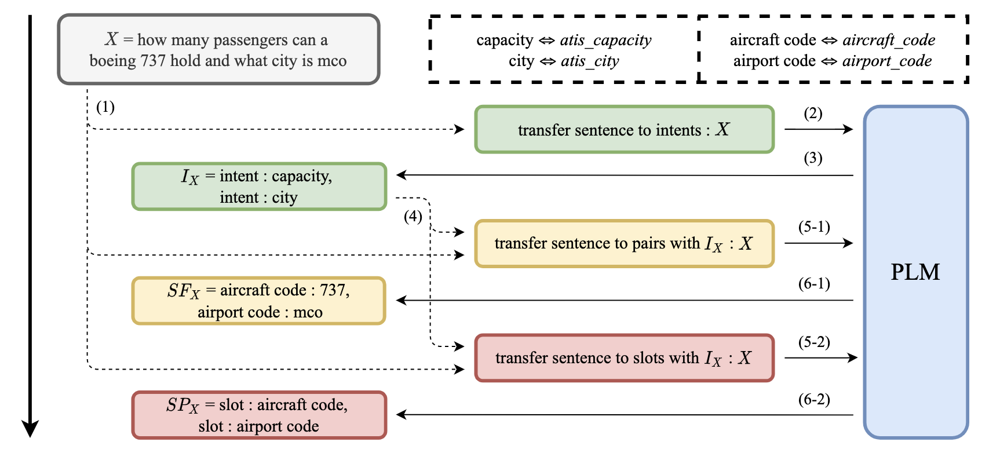
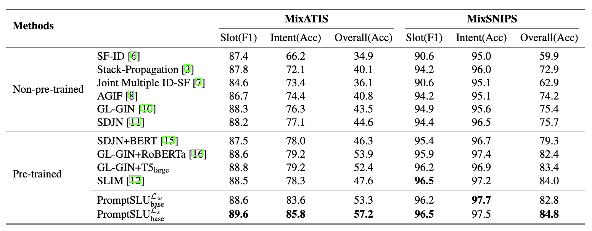
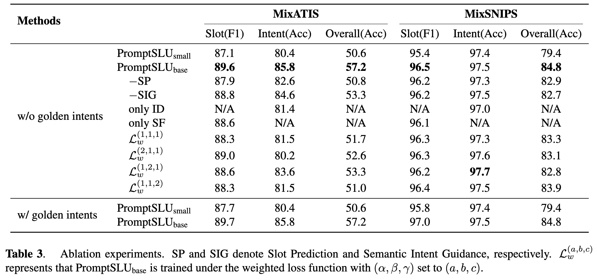
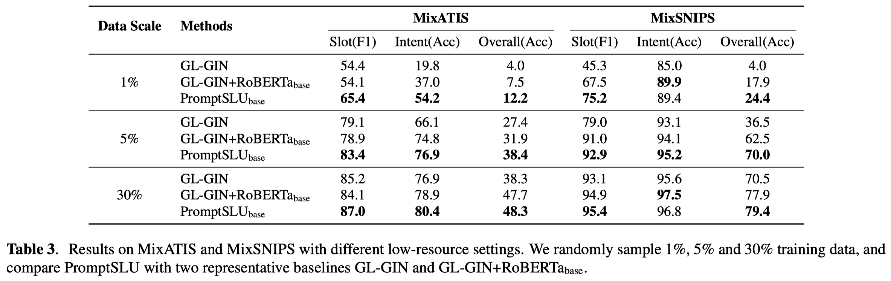
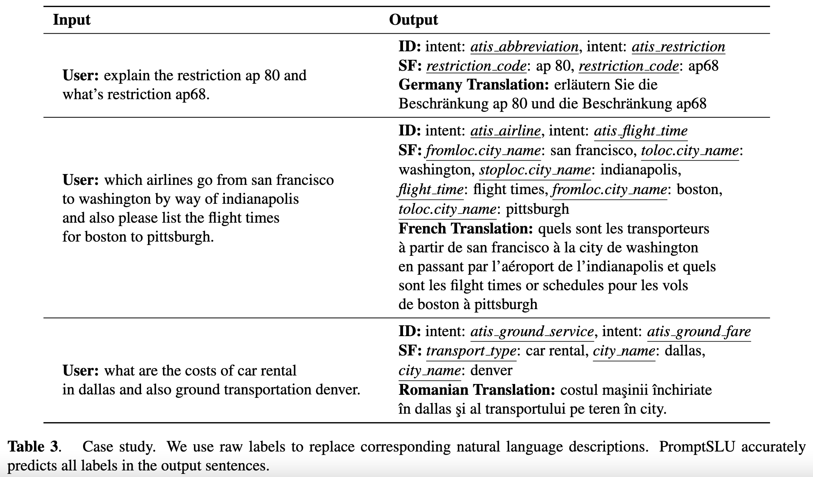

# A Unified Framework for Multi-intent Spoken Language Understanding with Prompting
Authors: Feifan Song, Lianzhe Huang, Houfeng Wang

arXiv: [Abstract](https://arxiv.org/abs/2210.03337) / [PDF](https://arxiv.org/pdf/2210.03337.pdf)

## The pipeline of PromptSLU
<div align="center"></div>

## Complete Experiments
### Main Results
<div align="center"></div>

### Ablation Study
<div align="center"></div>

### Low-Resource Results
<div align="center"></div>

## Case Study
PromptSLU makes predictions along the order of their appearance in the user input, which can be further utilized for supplementary requirements. Moreover, there exist slot-value pairs with sharing slots but distinct values, but PromptSLU precisely predicts them without the lack of intrinsic order.

Surprisingly, PromptSLU sometimes manages to translate user utterances into different language versions, with specific prefixes used in the pre-training stage of backbones. This suggests its potential of alleviating forgetting knowledge acquired in the pre-training stage after fine-tuning.
<div align="center"></div>


## Implementation
### Packages Requirement
```
python==3.7.11
cudatoolkit==11.3
torch==1.11.0
transformers==4.14.1
datasets==1.18.4
accelerate==0.5.1
```

### Others
Please refer to the preprint version of this work, or more details contained in the code.

## Usage
We have placed the raw files of datasets involved (MixATIS and MixSNIPS), which can also be downloaded [here](https://github.com/yizhen20133868/GL-GIN/tree/master/data). Some scripts are prepared for easy start.

### Train
Please start the experiments with the following commands:
```
chmod 777 train_[DATASET].sh
./train_[DATASET].sh
```
where the placeholder `[DATASET]` can be **MixATIS** or **MixSNIPS**. Directories containing pre-processed training/test data and checkpoints will be automatically created.

### Test
After training, you can test the model through the following commands:
```
chmod 777 test.sh
./test.sh
```
with checkpoints we saved in `./results` directory. You may need to change the argument `dataset` in the script in order to pick checkpoints for different datasets.


## Citation
If this work is helpful to you, welcome to cite our paper as:
```
@misc{song2022unified,
      title={A Unified Framework for Multi-intent Spoken Language Understanding with Prompting}, 
      author={Feifan Song and Lianzhe Huang and Houfeng Wang},
      year={2022},
      eprint={2210.03337},
      archivePrefix={arXiv},
      primaryClass={cs.CL}
}
```

